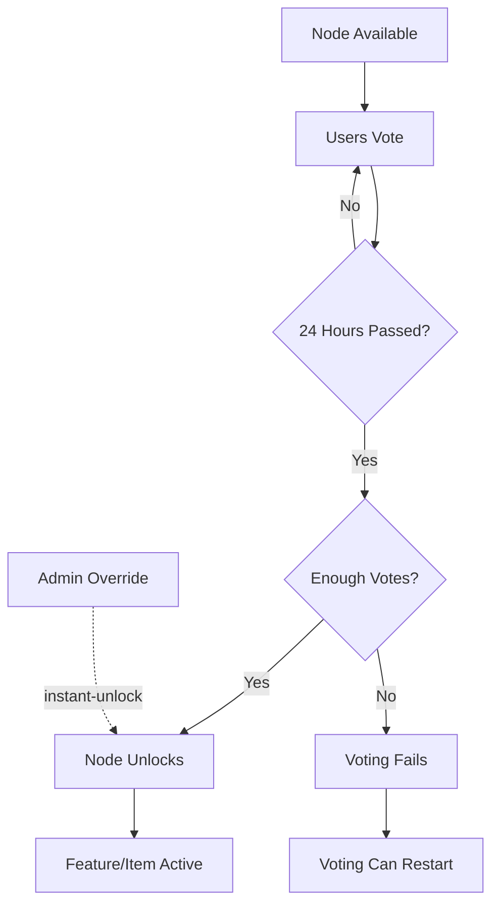

# Progression System API Documentation

## Overview

The Progression System provides community-driven feature unlocking through voting and engagement tracking. Features and items unlock progressively based on community participation.

**Base URL**: `/progression`

---

## Public Endpoints

### 1. Get Progression Tree

**Endpoint**: `GET /progression/tree`

**Description**: Returns the complete progression tree with unlock status for each node.

**Response**:

```json
{
  "nodes": [
    {
      "id": 1,
      "node_key": "progression_system",
      "node_type": "feature",
      "display_name": "Progression System",
      "description": "Unlock the community progression system",
      "parent_node_id": null,
      "max_level": 1,
      "unlock_cost": 0,
      "sort_order": 0,
      "is_unlocked": true,
      "unlocked_level": 1,
      "unlocked_at": "2025-01-01T00:00:00Z",
      "unlocked_by": "auto"
    }
  ]
}
```

**Fields**:

- `node_key` - Unique identifier for the node
- `node_type` - Type: `feature`, `item`, `upgrade`, `mechanic`
- `max_level` - Maximum unlock level (typically 1, but can be higher for upgrades)
- `unlock_cost` - Engagement score required per level
- `is_unlocked` - Whether this node is unlocked
- `unlocked_level` - Current unlock level (0 if locked)

---

### 2. Get Available Unlocks

**Endpoint**: `GET /progression/available`

**Description**: Returns nodes that are currently available for voting (prerequisites met, not yet unlocked).

**Response**:

```json
{
  "available": [
    {
      "id": 2,
      "node_key": "item_money",
      "display_name": "Money",
      "description": "Unlock the money item for trading",
      "unlock_cost": 500,
      "prerequisites_met": true
    }
  ]
}
```

---

### 3. Vote for Unlock

**Endpoint**: `POST /progression/vote`

**Description**: Submit a vote for unlocking a specific node/level.

**Request Body**:

```json
{
  "user_id": "user123",
  "node_key": "item_money",
  "target_level": 1
}
```

**Response** (Success):

```json
{
  "message": "Vote recorded successfully",
  "voting": {
    "node_id": 2,
    "target_level": 1,
    "vote_count": 42,
    "voting_started_at": "2025-01-01T00:00:00Z",
    "voting_ends_at": "2025-01-02T00:00:00Z",
    "is_active": true
  }
}
```

**Error Responses**:

- `400` - User already voted, node already unlocked, or prerequisites not met
- `404` - Node not found
- `500` - Server error

---

### 4. Get Progression Status

**Endpoint**: `GET /progression/status`

**Description**: Get current voting status and unlock statistics.

**Response**:

```json
{
  "active_voting": {
    "node_key": "item_money",
    "display_name": "Money",
    "target_level": 1,
    "vote_count": 42,
    "votes_needed": 100,
    "ends_at": "2025-01-02T00:00:00Z"
  },
  "total_unlocked": 5,
  "total_nodes": 14,
  "progress_percentage": 35.7
}
```

---

### 5. Get Engagement Breakdown

**Endpoint**: `GET /progression/engagement?user_id=user123`

**Description**: Get engagement metrics for a specific user.

**Query Parameters**:

- `user_id` (required) - User ID to get engagement for

**Response**:

```json
{
  "user_id": "user123",
  "total_score": 156,
  "breakdown": {
    "messages_sent": 50,
    "commands_used": 25,
    "items_crafted": 8,
    "items_used": 12
  },
  "weights": {
    "message": 1.0,
    "command": 2.0,
    "item_crafted": 3.0,
    "item_used": 1.5
  }
}
```

**Score Calculation**:

```
Total Score = (messages × 1.0) + (commands × 2.0) + (items_crafted × 3.0) + (items_used × 1.5)
Example: (50 × 1.0) + (25 × 2.0) + (8 × 3.0) + (12 × 1.5) = 50 + 50 + 24 + 18 = 142
```

---

## Admin Endpoints

**Authentication**: All admin endpoints require proper authentication (to be implemented).

### 6. Admin Unlock Node

**Endpoint**: `POST /progression/admin/unlock`

**Description**: Forcefully unlock a node at a specific level (bypasses voting).

**Request Body**:

```json
{
  "node_key": "feature_upgrade",
  "level": 1
}
```

**Response**:

```json
{
  "message": "Node unlocked successfully",
  "node_key": "feature_upgrade",
  "level": 1
}
```

**Use Cases**:

- Testing features before public unlock
- Special events or milestones
- Correcting unlock issues

---

### 7. Admin Relock Node

**Endpoint**: `POST /progression/admin/relock`

**Description**: Relock a previously unlocked node.

**Request Body**:

```json
{
  "node_key": "feature_upgrade",
  "level": 1
}
```

**Response**:

```json
{
  "message": "Node relocked successfully",
  "node_key": "feature_upgrade",
  "level": 1
}
```

---

### 8. Admin Instant Unlock

**Endpoint**: `POST /progression/admin/instant-unlock`

**Description**: End active voting early and unlock the node immediately.

**Request Body**:

```json
{
  "node_key": "item_money"
}
```

**Response**:

```json
{
  "message": "Voting ended and node unlocked",
  "node_key": "item_money",
  "final_vote_count": 78
}
```

---

### 9. Admin Reset Tree

**Endpoint**: `POST /progression/admin/reset`

**Description**: Reset the entire progression tree (annual reset).

**Request Body**:

```json
{
  "reset_by": "admin_username",
  "reason": "Annual reset for 2026",
  "preserve_user_data": true
}
```

**Parameters**:

- `preserve_user_data` - If true, keeps user-specific progression (recipes unlocked)

**Response**:

```json
{
  "message": "Progression tree reset successfully",
  "nodes_reset": 13,
  "root_preserved": true,
  "user_data_preserved": true
}
```

**⚠️ Warning**: This is a destructive operation. Only the root node remains unlocked after reset.

---

## Feature Gates

Certain endpoints are feature-gated and return `403 Forbidden` if the feature is not unlocked:

- **Buy Items** (`POST /user/item/buy`) → Requires `feature_buy` unlocked
- **Sell Items** (`POST /user/item/sell`) → Requires `feature_sell` unlocked
- **Upgrade Items** (`POST /user/item/upgrade`) → Requires `feature_upgrade` unlocked
- **Disassemble Items** (`POST /user/item/disassemble`) → Requires `feature_disassemble` unlocked

**Error Response**:

```json
{
  "error": "Upgrade feature is not yet unlocked"
}
```

**Status Code**: `403 Forbidden`

---

## Engagement Tracking

User actions are automatically tracked for progression:

| Action             | Metric Type    | Weight | Examples              |
| ------------------ | -------------- | ------ | --------------------- |
| Send Message       | `message`      | 1.0    | Chat messages         |
| Use Command        | `command`      | 2.0    | Any API endpoint      |
| Craft/Upgrade Item | `item_crafted` | 3.0    | Upgrade, disassemble  |
| Use Item           | `item_used`    | 1.5    | Consume potions, etc. |

**Tracking is automatic** - handlers record engagement after successful operations.

---

## Node Types

1. **Feature** - Unlocks game functionality (e.g., trading, crafting)
2. **Item** - Unlocks items (e.g., lootboxes, weapons)
3. **Upgrade** - Incremental improvements (e.g., cooldown reduction)
4. **Mechanic** - Game mechanics (future use)

---

## Voting Flow



---

## Error Codes

| Code | Meaning               | Common Causes                               |
| ---- | --------------------- | ------------------------------------------- |
| 400  | Bad Request           | Invalid JSON, missing fields, already voted |
| 403  | Forbidden             | Feature not unlocked, prerequisites not met |
| 404  | Not Found             | Node doesn't exist                          |
| 500  | Internal Server Error | Database error, service failure             |

---

## Rate Limiting

_To be implemented in production_

Recommended limits:

- Voting: 1 vote per user per node/level
- Status checks: 100 requests/minute per IP
- Admin operations: 10 requests/minute per admin

---

## Examples

### Example 1: Check What's Available and Vote

```bash
# 1. Get available unlocks
curl http://localhost:8080/progression/available

# 2. Vote for money item
curl -X POST http://localhost:8080/progression/vote \
  -H "Content-Type: application/json" \
  -d '{
    "user_id": "player123",
    "node_key": "item_money",
    "target_level": 1
  }'

# 3. Check voting status
curl http://localhost:8080/progression/status
```

### Example 2: Admin Testing

```bash
# Unlock all features for testing
for feature in feature_buy feature_sell feature_upgrade feature_disassemble; do
  curl -X POST http://localhost:8080/progression/admin/unlock \
    -H "Content-Type: application/json" \
    -d "{\"node_key\": \"$feature\", \"level\": 1}"
done

# View the tree
curl http://localhost:8080/progression/tree | jq '.nodes[] | {key: .node_key, unlocked: .is_unlocked}'
```

---

## Testing with Go Test Helper

For automated tests, use the test helper:

```go
import "github.com/osse101/BrandishBot_Go/internal/progression"

// In test setup:
helper := progression.NewTestHelper(progressionService)
helper.UnlockAllFeatures(ctx) // Unlocks buy, sell, upgrade, disassemble

// Or unlock specific features:
helper.UnlockFeature(ctx, progression.FeatureEconomy)
```

---

## Database Schema

The progression system uses 7 tables:

1. `progression_nodes` - Tree structure
2. `progression_unlocks` - Global unlock status
3. `progression_voting` - Active voting
4. `user_votes` - Vote tracking
5. `user_progression` - User-specific progression
6. `engagement_metrics` - User activity
7. `engagement_weights` - Scoring configuration
8. `progression_resets` - Reset history

See migration `0014_create_progression_tables.up.sql` for full schema.

---

## Migration to Production

Before going live:

1. **Run migrations**: `make migrate-up`
2. **Verify seed data**: Check 14 nodes exist
3. **Test voting flow**: Use admin commands to simulate
4. **Configure weights**: Adjust `engagement_weights` table if needed
5. **Set up monitoring**: Track vote counts and unlock events
6. **Document for users**: Explain voting system in Discord announcements

---

**Last Updated**: 2025-11-25  
**Version**: 1.0.0
