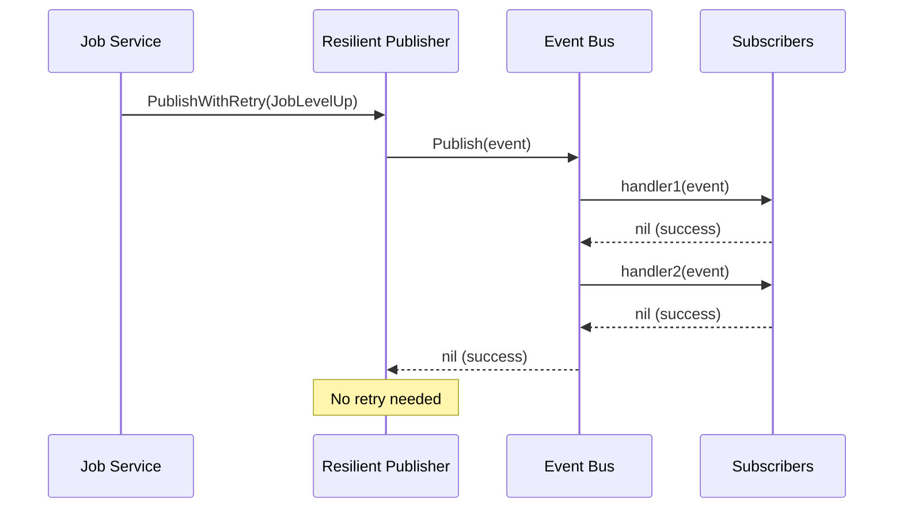
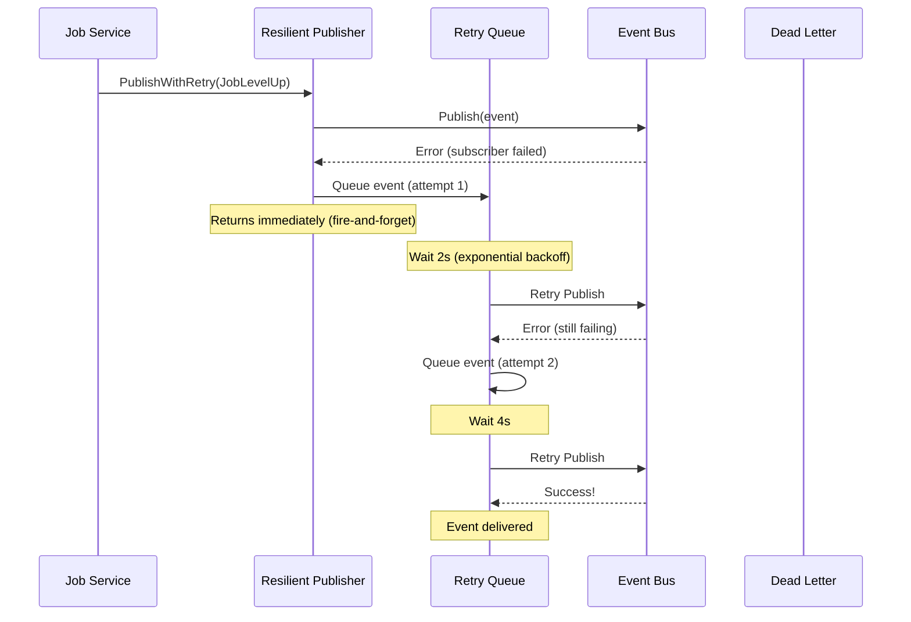
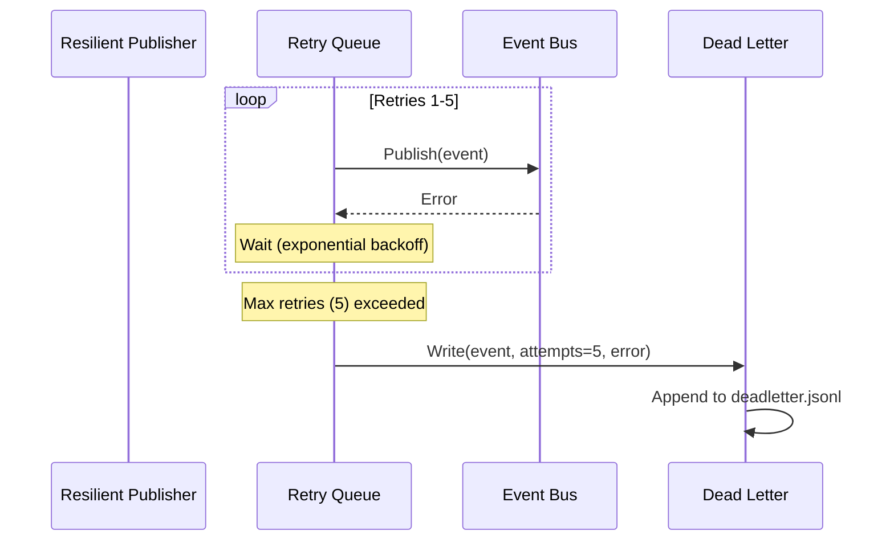

# Event System Architecture

This document describes the architecture, design decisions, and operational characteristics of the BrandishBot event system.

## Overview

BrandishBot uses an **asynchronous event-driven architecture** to decouple services and enable:
- **Non-blocking operations**: Domain operations never fail due to event system errors
- **Resilient delivery**: Events retry automatically with exponential backoff  
- **Extensibility**: New subscribers can be added without modifying publishers
- **Observability**: Dead-letter logging for failed events

### Key Principle: Fire-and-Forget

> **Domain operations must never fail due to event publishing errors.**

When a job levels up, inventory changes, or any domain event occurs, the operation succeeds immediately. Event notifications happen asynchronously with retry guarantees.

---

## Architecture Components

### 1. Event Bus (MemoryBus)

**Location:** `internal/event/event.go`

An in-process pub/sub bus using the Observer pattern.

**Responsibilities:**
- Register event subscribers
- Dispatch events synchronously to all subscrib ers
- Return errors if any subscriber fails

**Key Methods:**
```go
type Bus interface {
    Publish(ctx context.Context, event Event) error
    Subscribe(eventType Type, handler Handler)
}
```

**Current Implementation:** `MemoryBus` - synchronous, in-process
**Future:** Could be replaced with Redis Pub/Sub, NATS, or Kafka for distributed systems

---

### 2. Resilient Publisher

**Location:** `internal/event/resilient_publisher.go`

A wrapper around the Event Bus providing retry logic and dead-letter handling.

**Responsibilities:**
- Accept events via `PublishWithRetry` (never blocks or fails)
- Retry failed publishes with exponential backoff
- Write permanently failed events to dead-letter log
- Gracefully drain pending retries during shutdown

**Key Features:**
- **Async retry queue**: Buffered channel (1000 events)
- **Exponential backoff**: 2s → 4s → 8s → 16s → 32s
- **Dead-letter logging**: JSONL format for failed events
- **Graceful shutdown**: Drains queue before exit

**Configuration:**
```bash
EVENT_MAX_RETRIES=5             # Max retry attempts (default: 5)
EVENT_RETRY_DELAY=2s            # Base delay for exponential backoff (default: 2s)
EVENT_DEADLETTER_PATH=logs/event_deadletter.jsonl  # Dead-letter log path
```

---

### 3. Dead-Letter Writer

**Location:** `internal/event/deadletter.go`

Writes failed events to a JSONL file for manual inspection and recovery.

**Entry Format:**
```json
{
  "timestamp": "2026-01-03T03:00:00Z",
  "event": {
    "Type": "job_level_up",
    "Payload": {"user_id": "user123", "new_level": 5},
    "Metadata": {"source": "search"}
  },
  "attempts": 5,
  "last_error": "connection refused"
}
```

---

## Event Flow

### Successful Publish (No Retry)



### Failed Publish with Retry



### Retry Exhaustion → Dead Letter



---

## System Design Decisions

### Why Asynchronous?

**Problem:** Synchronous event publishing creates coupling and fragility.
- If Discord bot is down, should job level-ups fail? **No.**
- If event log DB is slow, should inventory updates block? **No.**

**Solution:** Fire-and-forget with async retry.
- Domain operations succeed immediately
- Events delivered "eventually" with best-effort retry
- Dead-letter log captures permanent failures

### Why In-Memory Event Bus?

**Current scale:** Single-instance application, low event volume
**Benefits:**
- Simple implementation
- No external dependencies
- Sufficient for current needs

**Migration path:** Interface allows swapping to distributed bus (Redis, NATS) when needed

### Why Exponential Backoff?

Prevents overwhelming a struggling subscriber with repeated failures.

**Pattern:** 2s → 4s → 8s → 16s → 32s
- Quick recovery for transient failures (2-4s)
- Backs off for persistent issues
- Total retry window: ~62 seconds

### Why Dead-Letter Log?

Events that consistently fail deserve human attention.

**Use cases:**
- Bug in subscriber handler
- Malformed event payload
- Permanent infrastructure failure

**Recovery:** Manual inspection and optional replay (future feature)

---

## Subscribers

Current subscribers registered in `cmd/app/main.go`:

### 1. Stats Service
**Events:** All event types  
**Purpose:** Record statistics for leaderboards, achievements, analytics

### 2. Event Log Service
**Events:** All event types  
**Purpose:** Persist events for audit trail, debugging

### 3. Metrics Collector
**Events:** All event types  
**Purpose:** Emit Prometheus metrics for monitoring

### 4. Progression Notifier
**Events:** `progression.cycle.completed`  
**Purpose:** Send notifications to Discord and Streamer.bot

### 5. Progression Event Handler
**Events:** Various progression events  
**Purpose:** Update progression state based on events

---

## Monitoring

### Dead-Letter Monitoring

**Alert on:** Events appearing in dead-letter log
```bash
# Monitor dead-letter file
tail -f logs/event_deadletter.jsonl
```

**Investigation:**
1. Check `last_error` field for root cause
2. Verify subscribers are healthy
3. Check event payload format

### Retry Queue Monitoring

**Metrics to track** (future enhancement):
- Retry queue depth
- Retry success rate
- Dead-letter rate
- Average retry latency

**Implementation:** Add metrics to `ResilientPublisher`

---

## Testing

### Unit Testing Events

```go
// Test event publishing
func TestPublishEvent(t *testing.T) {
    bus := event.NewMemoryBus()
    publisher, _ := event.NewResilientPublisher(bus, 3, 100*time.Millisecond, tmpFile)
    defer publisher.Shutdown(context.Background())
    
    publisher.PublishWithRetry(ctx, event.Event{
        Type: event.Type(domain.EventJobLevelUp),
        Payload: map[string]interface{}{
            "user_id": "test",
            "new_level": 5,
        },
    })
    
    // Wait for async processing
    time.Sleep(50 * time.Millisecond)
}
```

### Integration Testing Events

See `internal/job/event_test.go:TestAwardXP_PublishesEventOnLevelUp` for example.

---

## Configuration Reference

| Variable | Default | Description |
|----------|---------|-------------|
| `EVENT_MAX_RETRIES` | 5 | Maximum retry attempts per event |
| `EVENT_RETRY_DELAY` | 2s | Base delay for exponential backoff |
| `EVENT_DEADLETTER_PATH` | `logs/event_deadletter.jsonl` | Dead-letter log file path |

**Example `.env`:**
```bash
EVENT_MAX_RETRIES=5
EVENT_RETRY_DELAY=2s
EVENT_DEADLETTER_PATH=logs/event_deadletter.jsonl
```

---

## Future Enhancements

### 1. Dead-Letter Replay Tool
Manually replay failed events from dead-letter log:
```bash
./brandishbot replay-deadletter --file logs/event_deadletter.jsonl
```

### 2. Distributed Event Bus
Replace `MemoryBus` with Redis Pub/Sub or NATS for:
- Multi-instance deployments
- Event persistence
- Better scalability

### 3. Event Schemas
Define TypeScript-like schemas for event payloads:
```go
type JobLevelUpPayload struct {
    UserID   string `json:"user_id"`
    JobKey   string `json:"job_key"`
    NewLevel int    `json:"new_level"`
    OldLevel int    `json:"old_level"`
}
```

### 4. Metrics & Observability
- Retry queue depth gauge
- Dead-letter event counter
- Event publish latency histogram

---

## Related Documentation

- [Event Catalog](../events/EVENT_CATALOG.md) - All event types and schemas
- [Developer Guide](../development/EVENT_INTEGRATION.md) - How to add new events
- [Resilient Event Publishing Issue](../../docs/issues/resolved/resilient-event-publishing.md)

---

## Summary

The event system provides:
✅ **Reliability**: Fire-and-forget with retry guarantees  
✅ **Decoupling**: Publishers don't know about subscribers  
✅ **Observability**: Dead-letter logging for failures  
✅ **Simplicity**: In-memory bus for current scale  
✅ **Extensibility**: Easy to add new subscribers

**Design Philosophy:** Domain operations never fail due to event system errors.
