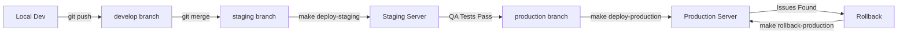

# Environment Guide: Development vs. Production

This guide explains how to run BrandishBot in different environments and the key differences between them.

## 1. Local Development Workstation

**Purpose**: Coding, testing, debugging, and running migrations manually.

### Prerequisites
Run `make check-deps` to verify:
- Go 1.25+
- Docker & Docker Compose (for database)
- Make
- Goose (for migrations)

### Workflow
1. **Start Database**:
   ```bash
   make docker-up  # Starts Postgres in Docker
   ```

2. **Run Migrations**:
   ```bash
   make migrate-up
   ```

3. **Run Application**:
   ```bash
   make run
   # OR
   go run cmd/app/*.go
   ```

4. **Run Tests**:
   ```bash
   make test
   ```

### Key Features
- **Hot Reload**: Not enabled by default (requires `air`), but you can restart `go run` quickly.
- **Direct DB Access**: Database port `5432` is exposed to localhost.
- **Logs**: Output to stdout in text format (readable).
- **Debug**: Can attach debugger (Delve) to the process.

---

## 2. Dockerized Server (Production/Staging)

**Purpose**: Deployment, stability, isolation.

### Prerequisites
- Docker & Docker Compose ONLY (Go/Make/Goose NOT required on host)

### Workflow
1. **Deploy & Start**:
   ```bash
   docker compose up -d --build
   ```
   *That's it!*

### How It Works
- **Containerized App**: The app runs inside a lightweight Alpine Linux container.
- **Auto-Migrations**: The container entrypoint (`devtool entrypoint`) automatically runs migrations before starting the app.
- **Internal Networking**: App talks to DB via internal Docker network (`db:5432`).
- **Security**: Database port `5432` can be closed to the outside world (remove `ports` mapping in `docker compose.yml` for production).

### Key Differences

| Feature | Local Dev | Dockerized Server |
|---------|-----------|-------------------|
| **Runtime** | Native Go binary on host | Alpine Linux Container |
| **Database** | Docker container (localhost:5432) | Docker container (db:5432) |
| **Migrations** | Manual (`goose up`) | Automatic (on startup) |
| **Logs** | Text format (stdout) | JSON/Text (configurable) |
| **Dependencies** | Go, Make, Goose required | Only Docker required |

### Troubleshooting Docker
```bash
# View logs
docker compose logs -f app

# Check health
curl http://localhost:8080/healthz

# Shell into container
docker compose exec app /bin/sh
```

---

## 3. Staging Environment

**Purpose**: Pre-production testing, QA validation, integration testing.

### Prerequisites
- Docker & Docker Compose ONLY
- Copy of production environment variables (`.env`)

### Deployment
```bash
# Deploy to staging (from staging branch)
git checkout staging
make deploy-staging

# OR manually
go run ./cmd/devtool deploy staging v1.2.0-rc1
```

### Configuration
- **Port**: 8081 (to avoid conflicts with local dev)
- **Database**: Separate volume (`pgdata-staging`)
- **Compose File**: `docker compose.staging.yml`
- **Resource Limits**: Production-like (CPU: 1 core, RAM: 512M)
- **Restart Policy**: `unless-stopped`

### Testing
```bash
# Run integration tests against staging
API_URL=http://localhost:8081 make test-staging

# Check health
make health-check-staging

# View logs
docker compose -f docker compose.staging.yml logs -f app
```

### Key Features
- Isolated from production database
- Production-like resource constraints
- Full integration test suite
- Database port exposed (5433) for testing

---

## 4. Production Environment

**Purpose**: Live deployment serving real users.

### Prerequisites
- Docker & Docker Compose ONLY
- Production environment variables (`.env` with production credentials)

### Deployment
```bash
# Deploy to production (from production branch)
git checkout production
make deploy-production

# OR manually
go run ./cmd/devtool deploy production v1.2.0
```

### Configuration
- **Port**: 8080
- **Database**: Production volume (`pgdata-production`)
- **Compose File**: `docker compose.production.yml`
- **Resource Limits**: Higher (CPU: 2 cores, RAM: 1GB)
- **Restart Policy**: `always` for database, `unless-stopped` for app
- **Security**: Database port NOT exposed externally

### Monitoring
```bash
# Check health
make health-check-prod

# View logs
docker compose -f docker compose.production.yml logs -f --tail=100 app

# Check resource usage
docker stats
```

### Rollback
```bash
# Emergency rollback
make rollback-production

# OR manually
go run ./cmd/devtool rollback production
```

### Key Features
- Maximum resource allocation
- Database not exposed externally (security)
- Automatic pre-deployment backups
- Health check validation before success
- Automatic rollback on failure

---

## Environment Comparison

| Feature | Local Dev | Staging | Production |
|---------|-----------|---------|------------|
| **Runtime** | Native Go | Docker Container | Docker Container |
| **Database** | Docker (port 5432) | Docker (port 5433) | Docker (internal only) |
| **Port** | 8080 | 8081 | 8080 |
| **Migrations** | Manual | Automatic | Automatic |
| **Backups** | Manual | Auto (on deploy) | Auto (on deploy) |
| **Resource Limits** | None | 1 CPU / 512M RAM | 2 CPU / 1GB RAM |
| **Restart Policy** | N/A | unless-stopped | always |
| **Health Checks** | Optional | Required | Required |
| **Deployment** | `make run` | `make deploy-staging` | `make deploy-production` |
| **Rollback** | N/A | `make rollback-staging` | `make rollback-production` |

---

## Workflow Overview



---

## Additional Resources

- [Deployment Workflow Guide](DEPLOYMENT_WORKFLOW.md) - Complete deployment procedures
- [Staging Tests](../development/STAGING_TESTS.md) - Integration test suite
- [Migrations Guide](../database/MIGRATIONS.md) - Database migration procedures
