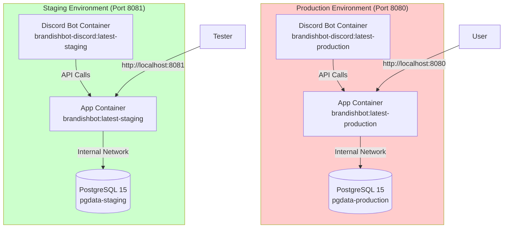

# Production Deployment Strategy: Same-Server Isolation

This document describes the production deployment strategy for running both staging and production environments on the same server without interference.

## Table of Contents
- [Overview](#overview)
- [Environment Isolation Strategy](#environment-isolation-strategy)
- [Network Isolation](#network-isolation)
- [Port Configuration](#port-configuration)
- [Database Separation](#database-separation)
- [Environment Variables](#environment-variables)
- [Resource Allocation](#resource-allocation)
- [Deployment Steps](#deployment-steps)
- [Verification Checklist](#verification-checklist)
- [Troubleshooting](#troubleshooting)

---

## Overview

BrandishBot supports running **staging** and **production** environments simultaneously on the same server. This is achieved through Docker's isolation features:

- **Separate Docker networks** - No cross-environment communication
- **Separate Docker volumes** - Isolated databases
- **Different ports** - No port conflicts
- **Independent containers** - Each environment runs its own app, Discord bot, and database
- **Resource limits** - Production gets priority allocation

> [!IMPORTANT]
> This configuration is designed for a single-server deployment where both environments are compiled and run **on the same machine**. The Docker images are built locally rather than pulled from a registry.

---

## Environment Isolation Strategy

### How Isolation Works

Each environment is completely isolated using Docker Compose's project separation:

| Isolation Layer | Staging | Production | Result |
|----------------|---------|------------|--------|
| **Docker Compose File** | `docker-compose.staging.yml` | `docker-compose.production.yml` | Separate container orchestration |
| **Docker Network** | `backend-staging` | `backend-production` | No network communication between environments |
| **Docker Volume** | `pgdata-staging` | `pgdata-production` | Separate databases |
| **Container Names** | `brandishbot_go-app-staging-1` | `brandishbot_go-app-production-1` | No name conflicts |
| **Port Mapping** | `8081:8080` (app)<br/>`5433:5432` (db) | `8080:8080` (app)<br/>*not exposed* (db) | No port conflicts |

### Container Architecture



---

## Network Isolation

### Docker Networks

Each environment has its own isolated bridge network:

**Staging Network:**
```yaml
networks:
  backend-staging:
    driver: bridge
```

**Production Network:**
```yaml
networks:
  backend-production:
    driver: bridge
```

### What This Means

- **No cross-talk**: Staging containers cannot communicate with production containers
- **Internal DNS**: Within each network, containers use service names (`db`, `app`) for communication
- **Firewall isolation**: Docker's bridge networks provide built-in isolation

### Verification

Check that networks are separate:

```bash
# List all Docker networks
docker network ls | grep backend

# Expected output:
# brandishbot_go_backend-staging      bridge    local
# brandishbot_go_backend-production   bridge    local

# Inspect a network
docker network inspect brandishbot_go_backend-production
```

---

## Port Configuration

### Port Mapping

| Environment | Component | Internal Port | External Port | Notes |
|------------|-----------|---------------|---------------|-------|
| **Production** | App | 8080 | 8080 | Main production API |
| **Production** | Database | 5432 | *not exposed* | Security: DB not accessible externally |
| **Staging** | App | 8080 | 8081 | Mapped to avoid conflict with production |
| **Staging** | Database | 5432 | 5433 | Exposed for testing/debugging |

### Why These Ports?

- **App port 8081 for staging**: Avoids collision with production on 8080
- **DB port 5433 for staging**: Allows direct database access for testing
- **DB not exposed for production**: Security best practice - only accessible via Docker network

### Accessing Environments

```bash
# Production API
curl http://localhost:8080/healthz

# Staging API
curl http://localhost:8081/healthz

# Staging Database (for testing)
psql -h localhost -p 5433 -U $DB_USER -d $DB_NAME

# Production Database (not externally accessible)
# Must exec into container:
docker compose -f docker-compose.production.yml exec db psql -U $DB_USER -d $DB_NAME
```

---

## Database Separation

### Volume Isolation

Each environment has its own persistent Docker volume:

**Staging:**
```yaml
volumes:
  pgdata-staging:
    driver: local
```

**Production:**
```yaml
volumes:
  pgdata-production:
    driver: local
```

### Database Configuration

| Setting | Staging | Production |
|---------|---------|------------|
| **Volume** | `pgdata-staging` | `pgdata-production` |
| **Data Path** | `/var/lib/docker/volumes/brandishbot_go_pgdata-staging/_data` | `/var/lib/docker/volumes/brandishbot_go_pgdata-production/_data` |
| **External Access** | ✅ Port 5433 | ❌ Not exposed |
| **Backups** | Auto on deploy | Auto on deploy |

### Migration Isolation

Migrations run independently in each environment:

- **Entrypoint script** (`scripts/docker-entrypoint.sh`) runs migrations on container startup
- Each environment's database has its own migration state
- No risk of staging migrations affecting production

### Backing Up Databases

```bash
# Backup production database
make db-export
# Creates: backups/backup_production_YYYYMMDD_HHMMSS.sql

# Backup staging database (manual)
COMPOSE_FILE=docker-compose.staging.yml make db-export

# Or directly
docker compose -f docker-compose.staging.yml exec db pg_dump -U $DB_USER -d $DB_NAME > staging_backup.sql
```

---

## Environment Variables

### Configuration Strategy

Both environments share the same `.env` file but use different values for certain variables:

**Shared Variables** (same in both environments):
- `DB_USER`
- `DB_PASSWORD`
- `DB_NAME`
- `DISCORD_TOKEN`
- `API_KEY`
- `STREAMERBOT_WEBHOOK_URL`

**Environment-Specific Variables** (set in docker-compose files):

| Variable | Staging | Production |
|----------|---------|------------|
| `ENVIRONMENT` | `staging` | `production` |
| `DB_HOST` | `db` (internal) | `db` (internal) |
| `API_URL` | `http://app:8080` | `http://app:8080` |

### Setting Environment Variables

**In `.env` file:**
```bash
# Database Configuration
DB_USER=brandishbot
DB_PASSWORD=secure_password_here
DB_NAME=brandishbot

# Server Configuration
LOG_LEVEL=info
ENVIRONMENT=dev  # Overridden by docker-compose

# Discord Configuration
DISCORD_TOKEN=your_bot_token
```

**In `docker-compose.staging.yml`:**
```yaml
environment:
  - ENVIRONMENT=staging
  - DB_HOST=db
```

**In `docker-compose.production.yml`:**
```yaml
environment:
  - ENVIRONMENT=production
  - DB_HOST=db
```

### Best Practices

> [!WARNING]
> **Never commit `.env` to version control**
> 
> - Add `.env` to `.gitignore` (already configured)
> - Use `.env.example` as a template
> - Rotate secrets regularly (especially `API_KEY` and `DB_PASSWORD`)

---

## Resource Allocation

### CPU and Memory Limits

Production gets priority resource allocation:

| Environment | Component | CPU Limit | Memory Limit | CPU Reserved | Memory Reserved |
|------------|-----------|-----------|--------------|--------------|-----------------|
| **Production** | App | 2.0 cores | 1 GB | 0.5 cores | 256 MB |
| **Production** | Discord Bot | 1.0 cores | 512 MB | 0.25 cores | 128 MB |
| **Production** | Database | 1.0 cores | 1 GB | 0.5 cores | 512 MB |
| **Staging** | App | 1.0 cores | 512 MB | 0.25 cores | 128 MB |
| **Staging** | Discord Bot | 0.5 cores | 256 MB | 0.1 cores | 64 MB |
| **Staging** | Database | *(no limit)* | *(no limit)* | *(none)* | *(none)* |

### Server Resource Requirements

**Minimum Server Specs:**
- **CPU**: 4 cores (to support both environments)
- **RAM**: 4 GB (production: ~2.5 GB, staging: ~1 GB, system: 0.5 GB)
- **Disk**: 20 GB (code, images, databases, logs)

**Recommended Server Specs:**
- **CPU**: 6-8 cores
- **RAM**: 8 GB
- **Disk**: 50 GB SSD

### Monitoring Resource Usage

```bash
# Real-time resource usage
docker stats

# Expected output:
# NAME                          CPU %   MEM USAGE / LIMIT
# brandishbot_go-app-production    5%     256MB / 1GB
# brandishbot_go-db-production     2%     512MB / 1GB
# brandishbot_go-app-staging       3%     128MB / 512MB
# brandishbot_go-db-staging        1%     200MB / unlimited
```

---

## Deployment Steps

### Initial Setup (First Time)

If deploying for the first time on a new server:

#### 1. Install Prerequisites

```bash
# Install Docker
curl -fsSL https://get.docker.com -o get-docker.sh
sudo sh get-docker.sh

# Install Docker Compose (if not included)
sudo apt-get install docker-compose-plugin

# Verify installation
docker --version
docker compose version
```

#### 2. Clone Repository

```bash
git clone https://github.com/osse101/BrandishBot_Go.git
cd BrandishBot_Go
```

#### 3. Configure Environment

```bash
# Copy example environment file
cp .env.example .env

# Edit with your actual values
nano .env
```

**Required variables to set:**
- `DB_USER` / `DB_PASSWORD` / `DB_NAME`
- `API_KEY` (generate with `openssl rand -hex 32`)
- `DISCORD_TOKEN` / `DISCORD_APP_ID` / `DISCORD_GUILD_ID`
- `STREAMERBOT_WEBHOOK_URL`

#### 4. Deploy Production

```bash
# Checkout production branch
git checkout production

# Deploy
make deploy-production
```

#### 5. Deploy Staging

```bash
# Checkout staging branch
git checkout staging

# Deploy
make deploy-staging
```

### Updating Existing Deployment

When you have code changes to deploy:

#### Production Update Workflow

```bash
# 1. Test on staging first
git checkout staging
git merge develop --no-ff
make deploy-staging

# 2. Validate staging
make health-check-staging
STAGING_URL=http://localhost:8081 make test-staging

# 3. If staging is good, promote to production
git checkout production
git merge staging --no-ff
git tag v1.2.3
make deploy-production

# 4. Monitor production
make health-check-prod
docker compose -f docker-compose.production.yml logs -f app
```

### Side-by-Side Deployment

Both environments can be deployed and running simultaneously:

```bash
# Start production
docker compose -f docker-compose.production.yml up -d

# Start staging
docker compose -f docker-compose.staging.yml up -d

# Check both are running
docker ps
# Should see 6 containers:
# - brandishbot_go-app-production-1
# - brandishbot_go-discord-production-1
# - brandishbot_go-db-production-1
# - brandishbot_go-app-staging-1
# - brandishbot_go-discord-staging-1
# - brandishbot_go-db-staging-1
```

### Managing Both Environments

```bash
# View all running containers
docker ps

# Stop production only
docker compose -f docker-compose.production.yml down

# Stop staging only
docker compose -f docker-compose.staging.yml down

# Stop everything
docker compose -f docker-compose.production.yml down
docker compose -f docker-compose.staging.yml down

# Restart production without downtime for staging
docker compose -f docker-compose.production.yml restart app discord

# View production logs
docker compose -f docker-compose.production.yml logs -f app

# View staging logs
docker compose -f docker-compose.staging.yml logs -f app
```

---

## Verification Checklist

After deploying both environments, verify complete isolation:

### ✅ Port Isolation

```bash
# Production is on 8080
curl http://localhost:8080/healthz
# Expected: {"status":"ok"}

# Staging is on 8081
curl http://localhost:8081/healthz
# Expected: {"status":"ok"}

# Ports don't conflict
netstat -tuln | grep -E '8080|8081|5432|5433'
# Expected: All ports bound to different services
```

### ✅ Network Isolation

```bash
# Production network
docker network inspect brandishbot_go_backend-production | grep -A 3 Containers
# Expected: Only production containers listed

# Staging network
docker network inspect brandishbot_go_backend-staging | grep -A 3 Containers
# Expected: Only staging containers listed

# Networks are separate
docker exec brandishbot_go-app-staging-1 ping -c 1 brandishbot_go-app-production-1
# Expected: ping: bad address (cannot resolve hostname)
```

### ✅ Database Isolation

```bash
# Production database (must exec into container)
docker compose -f docker-compose.production.yml exec db psql -U $DB_USER -d $DB_NAME -c "SELECT 'production' as environment;"
# Expected: "production"

# Staging database (can access via port 5433)
psql -h localhost -p 5433 -U $DB_USER -d $DB_NAME -c "SELECT 'staging' as environment;"
# Expected: "staging"

# Databases are separate (different data)
# Create a test table in staging
psql -h localhost -p 5433 -U $DB_USER -d $DB_NAME -c "CREATE TABLE test_staging (id INT);"

# Verify it doesn't exist in production
docker compose -f docker-compose.production.yml exec db psql -U $DB_USER -d $DB_NAME -c "\dt test_staging"
# Expected: "Did not find any relation named 'test_staging'"

# Cleanup
psql -h localhost -p 5433 -U $DB_USER -d $DB_NAME -c "DROP TABLE test_staging;"
```

### ✅ Resource Limits

```bash
docker inspect brandishbot_go-app-production-1 | grep -A 5 Memory
# Expected: "Memory": 1073741824 (1GB)

docker inspect brandishbot_go-app-staging-1 | grep -A 5 Memory
# Expected: "Memory": 536870912 (512MB)
```

### ✅ Environment Variables

```bash
# Production environment
docker compose -f docker-compose.production.yml exec app sh -c 'echo $ENVIRONMENT'
# Expected: production

# Staging environment
docker compose -f docker-compose.staging.yml exec app sh -c 'echo $ENVIRONMENT'
# Expected: staging
```

---

## Troubleshooting

### Problem: Port Already in Use

**Symptom:**
```
Error: bind: address already in use
```

**Solution:**
```bash
# Check which process is using the port
sudo lsof -i :8080
sudo lsof -i :8081

# If another container is using it
docker ps -a
docker stop <container_id>

# If a system service is using it
sudo systemctl stop <service_name>
```

### Problem: Containers Can't Connect to Database

**Symptom:**
```
Error: could not connect to database
```

**Solution:**
```bash
# Check database container is running
docker compose -f docker-compose.production.yml ps db
docker compose -f docker-compose.staging.yml ps db

# Check database health
docker compose -f docker-compose.production.yml exec db pg_isready -U $DB_USER -d $DB_NAME

# Check database logs
docker compose -f docker-compose.production.yml logs db

# Verify DB_HOST is set to 'db' (not 'localhost')
docker compose -f docker-compose.production.yml exec app env | grep DB_HOST
```

### Problem: Staging Can't Access Database on Port 5433

**Symptom:**
```bash
psql -h localhost -p 5433 -U $DB_USER -d $DB_NAME
# Error: could not connect to server
```

**Solution:**
```bash
# Verify port is exposed in docker-compose.staging.yml
grep -A 2 "ports:" docker-compose.staging.yml
# Should show: - "5433:5432"

# Check if port is listening
sudo netstat -tuln | grep 5433

# Restart staging database
docker compose -f docker-compose.staging.yml restart db
```

### Problem: Out of Memory

**Symptom:**
```
Error: Cannot allocate memory
```

**Solution:**
```bash
# Check current memory usage
docker stats --no-stream

# Reduce staging resource limits in docker-compose.staging.yml
# Or stop staging when not needed
docker compose -f docker-compose.staging.yml down

# Free system memory
sudo sync && echo 3 | sudo tee /proc/sys/vm/drop_caches
```

### Problem: Wrong Environment Deployed

**Symptom:** Staging changes appear in production

**Solution:**
```bash
# Verify you're on the right branch
git branch
# Expected: * production (for production deployment)

# Check which compose file is being used
# The Makefile should handle this automatically

# Verify containers
docker ps --format "table {{.Names}}\t{{.Image}}"
# Should show:
# - brandishbot_go-app-production-1   brandishbot:latest-production
# - brandishbot_go-app-staging-1      brandishbot:latest-staging

# If wrong image is running, redeploy
git checkout production
make deploy-production
```

### Problem: Disk Space Full

**Symptom:**
```
Error: No space left on device
```

**Solution:**
```bash
# Check disk usage
df -h

# Clean up old Docker images (keeps last 5)
docker images | grep brandishbot | tail -n +6 | awk '{print $3}' | xargs docker rmi

# Clean up dangling images
docker image prune -f

# Clean up stopped containers
docker container prune -f

# Clean up unused volumes (CAREFUL - only if you're sure)
docker volume ls
# Manually remove old/unused volumes
docker volume rm <volume_name>

# Check database backup sizes
du -sh backups/*
# Remove old backups if needed
rm backups/backup_staging_*.sql  # Keep production backups!
```

---

## Advanced Topics

### Sharing Discord Bot Between Environments

> [!NOTE]
> The current setup runs **two separate Discord bots** (one for staging, one for production).
> 
> If you want to use the **same Discord bot** for both environments, you need to route commands based on context:

**Option 1:** Use separate Discord guilds (servers)
- Staging bot in Test Discord Server
- Production bot in Live Discord Server

**Option 2:** Use command prefixes
- Staging: `/staging-` prefix (e.g., `/staging-inventory`)
- Production: `/` prefix (e.g., `/inventory`)

**Option 3:** Use a single bot with environment detection
- Modify `internal/discord` to check `ENVIRONMENT` variable
- Route commands to correct API (`http://app:8080` resolves differently in each network)

### Running Only Production

If you don't need staging on the server:

```bash
# Only start production
docker compose -f docker-compose.production.yml up -d

# Production uses standard ports (8080)
curl http://localhost:8080/healthz
```

### Running Staging Temporarily

If you only need staging for testing:

```bash
# Start staging
docker compose -f docker-compose.staging.yml up -d

# Test
curl http://localhost:8081/healthz

# Stop when done (frees resources)
docker compose -f docker-compose.staging.yml down
```

---

## Summary

### Key Isolation Mechanisms

| Mechanism | How It's Achieved | Benefit |
|-----------|-------------------|---------|
| **Network Isolation** | Separate Docker bridge networks | Containers can't communicate across environments |
| **Port Isolation** | Different external port mappings | No port conflicts |
| **Database Isolation** | Separate Docker volumes | Independent data storage |
| **Resource Isolation** | Docker resource limits | Production gets priority |
| **Container Isolation** | Separate compose projects | Independent lifecycle management |

### Quick Commands Reference

```bash
# Deploy production
make deploy-production

# Deploy staging
make deploy-staging

# Check production health
make health-check-prod

# Check staging health
make health-check-staging

# View production logs
docker compose -f docker-compose.production.yml logs -f app

# View staging logs
docker compose -f docker-compose.staging.yml logs -f app

# Stop production
docker compose -f docker-compose.production.yml down

# Stop staging
docker compose -f docker-compose.staging.yml down

# Restart production (no downtime for staging)
docker compose -f docker-compose.production.yml restart

# Check all containers
docker ps
```

---

## Related Documentation

- [Deployment Workflow](file:///home/osse1/projects/BrandishBot_Go/docs/deployment/DEPLOYMENT_WORKFLOW.md) - Complete deployment procedures
- [Hotfix Guidelines](file:///home/osse1/projects/BrandishBot_Go/docs/deployment/HOTFIX_GUIDELINES.md) - What can be hotfixed vs. full deployment
- [Environment Setup](file:///home/osse1/projects/BrandishBot_Go/docs/deployment/ENVIRONMENTS.md) - Development vs. production setup
- [Rollback Procedures](file:///home/osse1/projects/BrandishBot_Go/docs/deployment/DEPLOYMENT_WORKFLOW.md#rollback-procedures) - Emergency rollback steps
