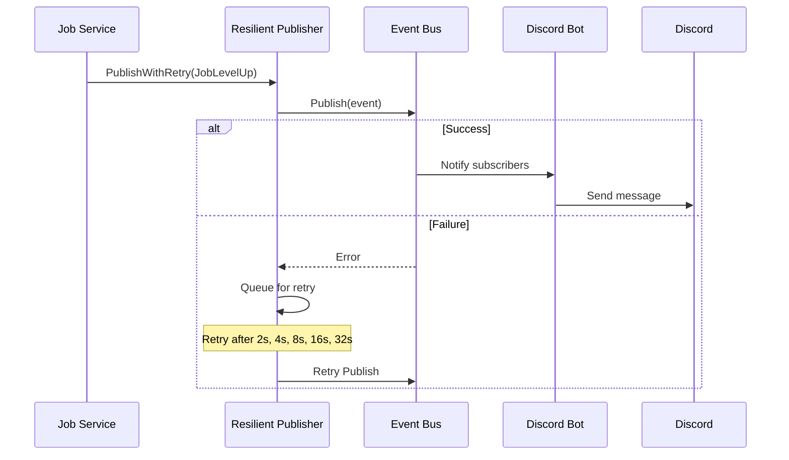

RESOLVED

# Document Event System Architecture

**Priority:** HIGH  
**Complexity:** 3/10  
**Estimated Effort:** 1-2 hours  
**Created:** 2026-01-03

## Problem

The event system lacks documentation:
- No overview of architecture and design decisions
- No catalog of available events and their contracts
- No developer guide for adding new events
- No monitoring instructions

This creates confusion for:
- New developers trying to understand the pub/sub system
- Contributors wanting to add new events
- Ops team monitoring event delivery

## Proposed Solution

Create three comprehensive documentation files:
1. Event system architecture overview
2. Event catalog with payload schemas
3. Developer guide for adding events

## Implementation

### 1. Architecture Overview

Create [`docs/architecture/event_system.md`](file:///home/osse1/projects/BrandishBot_Go/docs/architecture/event_system.md):

**Contents:**
- Overview of asynchronous event bus
- Component descriptions (Event Bus, Resilient Publisher)
- Event flow diagram (Mermaid)
- Error handling strategy (never fail domain operations)
- Configuration options
- Monitoring instructions

**Key Sections:**

#### Event Flow Diagram


#### Configuration Table

| Variable | Default | Description |
|----------|---------|-------------|
| `EVENT_MAX_RETRIES` | 5 | Max retry attempts per event |
| `EVENT_RETRY_DELAY_SECONDS` | 2 | Base delay between retries (exponential backoff) |
| `EVENT_DEADLETTER_PATH` | `./data/deadletter.jsonl` | Path to dead-letter log file |

### 2. Event Catalog

Create [`docs/events.md`](file:///home/osse1/projects/BrandishBot_Go/docs/events.md):

**Format for each event:**
- Event name and type
- When it's emitted
- Source location
- Payload schema (JSON example)
- List of subscribers
- Example handler code

**Initial Event:**

#### EventJobLevelUp
**Emitted when:** A user's job level increases  
**Source:** `internal/job/service.go`

**Payload:**
```json
{
  "user_id": "uuid-string",
  "job_key": "explorer|blacksmith",
  "old_level": 0,
  "new_level": 1,
  "timestamp": "2026-01-03T02:00:00Z"
}
```

**Subscribers:**
- Discord bot: Sends congratulatory message to user
- Webhook service: Notifies external systems

**Example Handler:**
```go
func handleJobLevelUp(ctx context.Context, event event.Event) error {
    payload := event.Payload.(map[string]interface{})
    userID := payload["user_id"].(string)
    newLevel := payload["new_level"].(int)
    
    return discordBot.SendMessage(userID, 
        fmt.Sprintf("🎉 Congratulations! You reached level %d!", newLevel))
}

// Register in main.go:
eventBus.Subscribe(event.Type(domain.EventJobLevelUp), handleJobLevelUp)
```

### 3. Developer Guide

Add section to [`CONTRIBUTING.md`](file:///home/osse1/projects/BrandishBot_Go/CONTRIBUTING.md):

**Contents:**
- How to define a new event type
- How to publish events (use ResilientPublisher)
- How to subscribe to events
- Testing event handlers
- Documentation requirements

**Example:**

```markdown
## Adding New Events

1. **Define event type** in `internal/domain/events.go`:
   ```go
   const EventMyNewEvent EventType = "my_new_event"
   ```

2. **Publish event** using ResilientPublisher:
   ```go
   event := event.Event{
       Type: event.Type(domain.EventMyNewEvent),
       Payload: map[string]interface{}{
           "key": "value",
       },
   }
   s.publisher.PublishWithRetry(ctx, event)
   ```

3. **Document event** in `docs/events.md`
4. **Add subscriber** in `cmd/app/main.go` or plugin module
```

## Implementation Checklist

- [ ] Create `docs/architecture/event_system.md`
  - [ ] Overview section
  - [ ] Components section (Event Bus, Resilient Publisher)
  - [ ] Event flow Mermaid diagram
  - [ ] Error handling strategy
  - [ ] Configuration table
  - [ ] Monitoring instructions
- [ ] Create `docs/events.md`
  - [ ] Document EventJobLevelUp
  - [ ] Add event template for future events
  - [ ] Include example handlers
- [ ] Update `CONTRIBUTING.md`
  - [ ] Add "Adding New Events" section
  - [ ] Include step-by-step guide
  - [ ] Link to event catalog
- [ ] Update `README.md`
  - [ ] Add link to event system docs
  - [ ] Add link to event catalog

## Affected Files

- [NEW] `docs/architecture/event_system.md`
- [NEW] `docs/events.md`
- [MODIFY] `CONTRIBUTING.md`
- [MODIFY] `README.md`

## Success Criteria

- ✅ Event system architecture fully documented
- ✅ All current events cataloged with examples
- ✅ Developer guide for adding new events complete
- ✅ Monitoring instructions clear and actionable
- ✅ Mermaid diagrams render correctly
- ✅ All code examples tested and working

## Template: Event Documentation

Use this template when documenting new events in `docs/events.md`:

```markdown
### EventName
**Emitted when:** [Trigger condition]
**Source:** [File path]

**Payload:**
```json
{
  "field1": "type",
  "field2": 123
}
```

**Subscribers:**
- Service 1: Purpose
- Service 2: Purpose

**Example Handler:**
```go
// Handler code example
```
```

## Benefits

1. **Onboarding:** New developers understand event system quickly
2. **Consistency:** Standard format for all event documentation
3. **Reliability:** Developers know to use ResilientPublisher
4. **Debugging:** Clear monitoring instructions reduce troubleshooting time
5. **Future-proof:** Easy to maintain and extend

## Related Issues

- [resilient-event-publishing.md](file:///home/osse1/projects/BrandishBot_Go/docs/issues/resilient-event-publishing.md) - Implements the system being documented
- Implementation plan: [implementation_plan.md](file:///home/osse1/.gemini/antigravity/brain/db319d15-571c-413e-a190-ece6fbdbc1e5/implementation_plan.md)
