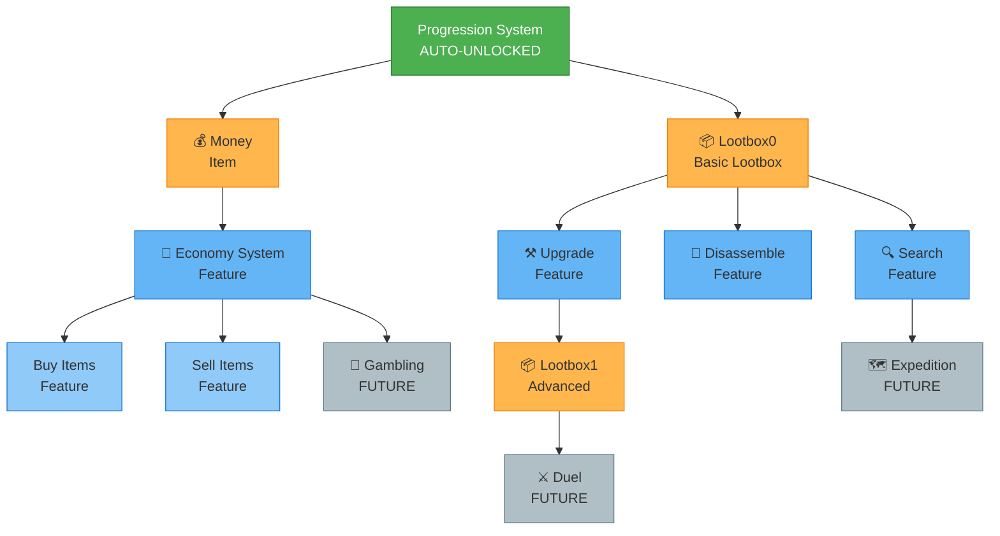

# Progression Tree Structure

## Legend

- 🟢 **Green**: Auto-unlocked (root)
- 🟠 **Orange**: Items (money, lootboxes)
- 🔵 **Blue**: Features (economy, crafting)
- ⚪ **Gray**: Future content

## Unlock Flow Example

1. **Start**: Progression System (auto-unlocked)
2. **Vote Phase**: Community votes between Money or Lootbox0
3. **Criteria Met**: After X engagement (messages, commands used)
4. **Unlock**: Chosen option becomes available
5. **New Options**: Children of unlocked node become available for voting
6. **Repeat**: Continue building the tree

## Foundational Features (Always Available)

These are **never locked**:
- ✅ `use_item` - Use consumables
- ✅ `add_item` - Add items to inventory
- ✅ `remove_item` - Remove items
- ✅ `get_inventory` - View inventory
- ✅ `get_stats` - View statistics
- ✅ User registration

## Locked Features (Require Unlock)

**Items**:
- `lootbox1`, `lootbox2`, `blaster`, etc.

**Features**:
- `buy`, `sell` - Economy
- `upgrade`, `disassemble` - Crafting
- `gamble`, `duel`, `expedition` - Game modes

**Incremental Upgrades** (can unlock multiple times):
- Cooldown reduction (e.g., 10% → 20% → 30%)
- Lootbox chances (improve drop rates)
- Economy multipliers
