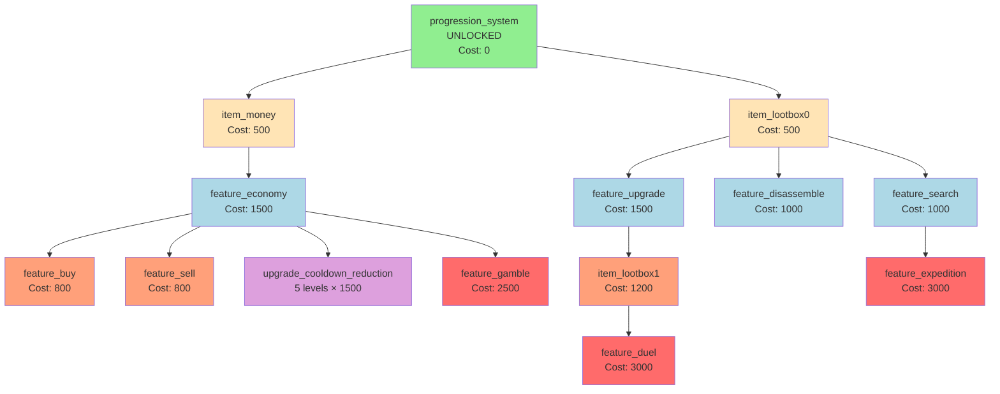

# Progression Tree Structure

## Visual Tree

```
progression_system (ROOT) [AUTO-UNLOCKED]
    Cost: 0 | Type: feature
    ├─── item_money
    │     Cost: 500 | Type: item
    │     └─── feature_economy
    │           Cost: 1500 | Type: feature
    │           ├─── feature_buy
    │           │     Cost: 800 | Type: feature
    │           ├─── feature_sell
    │           │     Cost: 800 | Type: feature
    │           └─── upgrade_cooldown_reduction [5 LEVELS]
    │                 Cost: 1500 per level | Type: upgrade
    │
    └─── item_lootbox0
          Cost: 500 | Type: item
          ├─── feature_upgrade
          │     Cost: 1500 | Type: feature
          │     └─── item_lootbox1
          │           Cost: 1200 | Type: item
          │           └─── feature_duel
          │                 Cost: 3000 | Type: feature
          ├─── feature_disassemble
          │     Cost: 1000 | Type: feature
          └─── feature_search
                Cost: 1000 | Type: feature
                └─── feature_expedition
                      Cost: 3000 | Type: feature

Additional Branch from feature_economy:
    feature_gamble
    Cost: 2500 | Type: feature
```

---

## Unlock Path Analysis

### Tier 1: Foundation (Root Level)
**Cost: 0 (Auto-unlocked)**
- `progression_system` - Enables the entire progression system

### Tier 2: First Choices (Direct from Root)
**Cost: 500 each**
- `item_money` → Unlocks money item (prerequisite for economy)
- `item_lootbox0` → Unlocks basic lootbox (prerequisite for crafting/upgrades)

### Tier 3: Core Features (1 step from root)
**Cost: 1000-1500**
- `feature_economy` (from money) → Unlocks marketplace features
- `feature_upgrade` (from lootbox0) → Unlocks item upgrading
- `feature_disassemble` (from lootbox0) → Unlocks item disassembly
- `feature_search` (from lootbox0) → Unlocks search/filtering

### Tier 4: Sub-Features (2 steps from root)
**Cost: 800-1200**
- `feature_buy` (from economy) → Buy items from market
- `feature_sell` (from economy) → Sell items to market
- `item_lootbox1` (from upgrade) → Advanced lootbox with better rewards

### Tier 5: Advanced Features (3+ steps from root)
**Cost: 2500-3000**
- `feature_gamble` (from economy) → High risk/reward gambling
- `feature_duel` (from lootbox1) → PvP combat
- `feature_expedition` (from search) → Adventure system

### Special: Multi-Level Upgrade
**5 Levels Available**
- `upgrade_cooldown_reduction` (from economy)
  - Level 1: Cost 1500
  - Level 2: Cost 1500
  - Level 3: Cost 1500
  - Level 4: Cost 1500
  - Level 5: Cost 1500
  - **Total: 7500 engagement score for all levels**

---

## Unlock Sequence Recommendations

### Week 1-2: Foundation
1. ✅ `progression_system` (auto)
2. 🗳️ `item_money` (500)
3. 🗳️ `item_lootbox0` (500)

### Week 3-4: Economy Basics
4. 🗳️ `feature_economy` (1500) *requires money*
5. 🗳️ `feature_buy` (800) *requires economy*
6. 🗳️ `feature_sell` (800) *requires economy*

### Week 5-6: Crafting System
7. 🗳️ `feature_upgrade` (1500) *requires lootbox0*
8. 🗳️ `feature_disassemble` (1000) *requires lootbox0*

### Week 7-8: Utility & Search
9. 🗳️ `feature_search` (1000) *requires lootbox0*
10. 🗳️ `item_lootbox1` (1200) *requires upgrade*

### Week 9-10: Incremental Upgrades
11. 🗳️ `upgrade_cooldown_reduction` Level 1 (1500)
12. 🗳️ `upgrade_cooldown_reduction` Level 2 (1500)

### Week 11+: Advanced Content
13. 🗳️ `feature_gamble` (2500) *requires economy*
14. 🗳️ `feature_duel` (3000) *requires lootbox1*
15. 🗳️ `feature_expedition` (3000) *requires search*

**Total Weeks**: ~15 weeks to fully unlock everything

---

## Dependency Graph



**Legend**:
- 🟢 Green: Auto-unlocked (Root)
- 🟡 Yellow: Tier 2 (500 cost)
- 🔵 Blue: Tier 3 (1000-1500 cost)
- 🟠 Orange: Tier 4 (800-1200 cost)
- 🔴 Red: Tier 5 (2500-3000 cost)
- 🟣 Purple: Multi-level upgrades

---

## Feature Gate Impact

### Gated Features (Require Unlocks)

| Feature | Node Required | Cost to Unlock | Impact |
|---------|--------------|----------------|---------|
| **Buy Items** | `feature_buy` | 800 + 1500 + 500 = **2800** | Can purchase from market |
| **Sell Items** | `feature_sell` | 800 + 1500 + 500 = **2800** | Can sell to market |  
| **Upgrade Items** | `feature_upgrade` | 1500 + 500 = **2000** | Can improve item quality |
| **Disassemble Items** | `feature_disassemble` | 1000 + 500 = **1500** | Can break down items |

*Cost includes all prerequisites*

### Always Available (Not Gated)

- User registration
- Inventory viewing
- Item gifting/transferring
- Item adding/removing (admin)
- Recipe viewing
- Price checking

---

## Engagement Score Requirements

Based on default weights:
- 1 message = 1 point
- 1 command = 2 points
- 1 item crafted = 3 points
- 1 item used = 1.5 points

### To Unlock `feature_buy` (2800 total):
- Option A: **2800 messages**
- Option B: **1400 commands**
- Option C: **933 items crafted**
- Option D: **Mix** - 1000 messages + 300 commands + 200 crafted + 200 used

### Community Example:
With 100 active users contributing equally for `item_money` (500 cost):
- Each user needs ~5 messages OR
- Each user needs 2-3 commands OR
- Each user needs 1-2 items crafted

---

## Node Keys Reference

Quick reference for API calls and admin commands:

```
ROOT:
  progression_system

ITEMS:
  item_money
  item_lootbox0
  item_lootbox1

FEATURES:
  feature_economy
  feature_buy
  feature_sell
  feature_upgrade
  feature_disassemble
  feature_search
  feature_gamble
  feature_duel
  feature_expedition

UPGRADES:
  upgrade_cooldown_reduction  (levels 1-5)
```

---

## Database Representation

The tree is stored in `progression_nodes` table:

```sql
-- Example: feature_buy node
id: 7
node_key: 'feature_buy'
node_type: 'feature'
parent_node_id: 3  -- points to feature_economy
max_level: 1
unlock_cost: 800
```

**Traversal**: Follow `parent_node_id` to build the tree and check prerequisites.

---

## Expansion Possibilities

Future nodes that could be added:

```
feature_trading (from economy)
  └─── feature_auction_house

feature_crafting_2 (from upgrade)
  └─── feature_enchanting
  └─── feature_sockets

feature_social (from root)
  └─── feature_guilds
  └─── feature_leaderboards

item_lootbox2 (from lootbox1)
  └─── feature_raid
```

**Adding Nodes**: Simply insert into `progression_nodes` table with appropriate parent_node_id and cost.

---

**See Also**:
- [API Documentation](../api/PROGRESSION_API.md)
- [Admin Guide](PROGRESSION_ADMIN_GUIDE.md)
- [Database Schema](../../migrations/0014_create_progression_tables.up.sql)
