# Progression Tree Structure

```mermaid
graph TD
    ROOT[Progression System<br/>AUTO-UNLOCKED]
    
    ROOT --> MONEY[💰 Money<br/>Item]
    ROOT --> LOOTBOX0[📦 Lootbox0<br/>Basic Lootbox]
    
    MONEY --> ECONOMY[🏪 Economy System<br/>Feature]
    ECONOMY --> BUY[Buy Items<br/>Feature]
    ECONOMY --> SELL[Sell Items<br/>Feature]
    ECONOMY --> GAMBLE[🎲 Gambling<br/>FUTURE]
    
    LOOTBOX0 --> UPGRADE[⚒️ Upgrade<br/>Feature]
    LOOTBOX0 --> DISASSEMBLE[🔧 Disassemble<br/>Feature]
    LOOTBOX0 --> SEARCH[🔍 Search<br/>Feature]
    
    UPGRADE --> LOOTBOX1[📦 Lootbox1<br/>Advanced]
    LOOTBOX1 --> DUEL[⚔️ Duel<br/>FUTURE]
    SEARCH --> EXPEDITION[🗺️ Expedition<br/>FUTURE]
    
    style ROOT fill:#4CAF50,stroke:#2E7D32,color:#fff
    style MONEY fill:#FFB74D,stroke:#F57C00
    style LOOTBOX0 fill:#FFB74D,stroke:#F57C00
    style ECONOMY fill:#64B5F6,stroke:#1976D2
    style BUY fill:#90CAF9,stroke:#1976D2
    style SELL fill:#90CAF9,stroke:#1976D2
    style UPGRADE fill:#64B5F6,stroke:#1976D2
    style DISASSEMBLE fill:#64B5F6,stroke:#1976D2
    style SEARCH fill:#64B5F6,stroke:#1976D2
    style LOOTBOX1 fill:#FFB74D,stroke:#F57C00
    style GAMBLE fill:#B0BEC5,stroke:#607D8B
    style DUEL fill:#B0BEC5,stroke:#607D8B
    style EXPEDITION fill:#B0BEC5,stroke:#607D8B
```

## Legend

- 🟢 **Green**: Auto-unlocked (root)
- 🟠 **Orange**: Items (money, lootboxes)
- 🔵 **Blue**: Features (economy, crafting)
- ⚪ **Gray**: Future content

## Unlock Flow Example

1. **Start**: Progression System (auto-unlocked)
2. **Vote Phase**: Community votes between Money or Lootbox0
3. **Criteria Met**: After X engagement (messages, commands used)
4. **Unlock**: Chosen option becomes available
5. **New Options**: Children of unlocked node become available for voting
6. **Repeat**: Continue building the tree

## Foundational Features (Always Available)

These are **never locked**:
- ✅ `use_item` - Use consumables
- ✅ `add_item` - Add items to inventory
- ✅ `remove_item` - Remove items
- ✅ `get_inventory` - View inventory
- ✅ `get_stats` - View statistics
- ✅ User registration

## Locked Features (Require Unlock)

**Items**:
- `lootbox1`, `lootbox2`, `blaster`, etc.

**Features**:
- `buy`, `sell` - Economy
- `upgrade`, `disassemble` - Crafting
- `gamble`, `duel`, `expedition` - Game modes

**Incremental Upgrades** (can unlock multiple times):
- Cooldown reduction (e.g., 10% → 20% → 30%)
- Lootbox chances (improve drop rates)
- Economy multipliers
